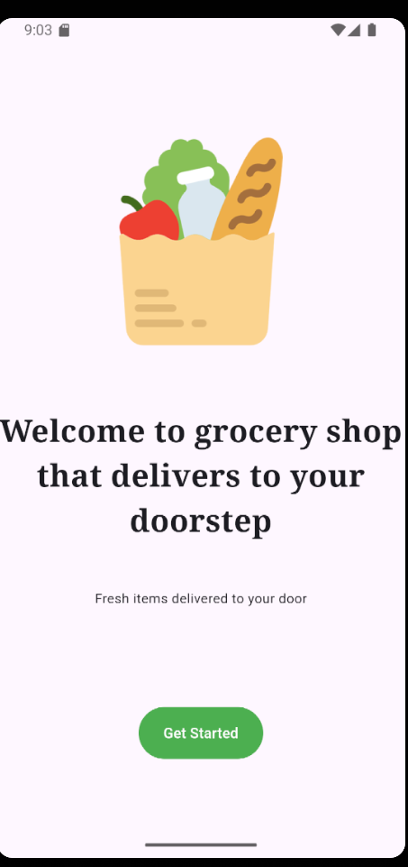
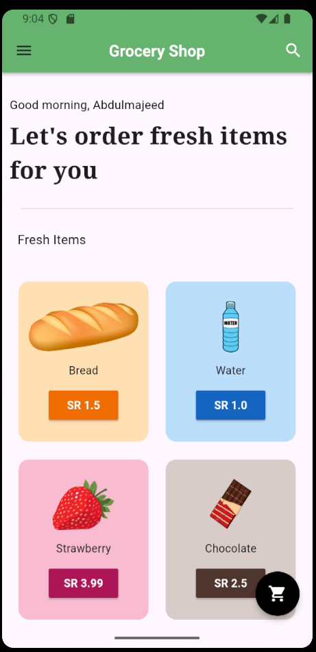
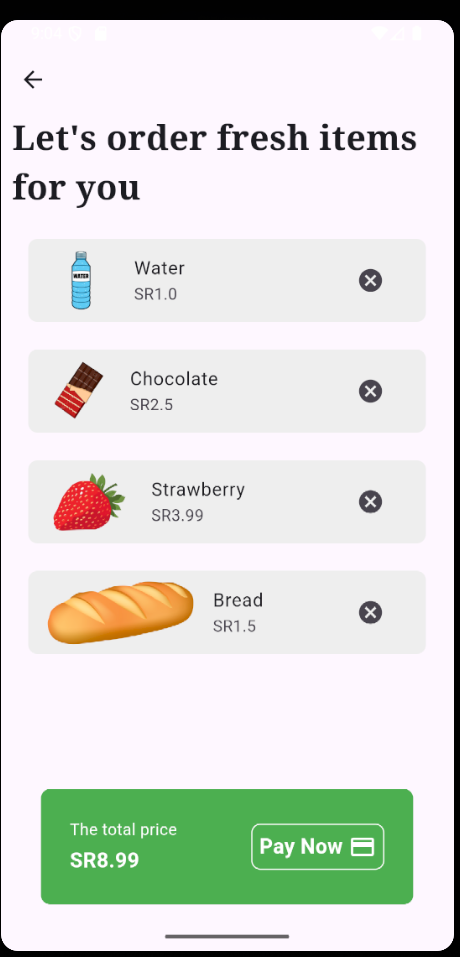

# Grocery Shop Flutter Project

## Overview
Welcome to the Grocery Shop Flutter project! This app is designed to help users browse, search, and purchase groceries conveniently. It's built using Flutter, a UI toolkit for crafting natively compiled applications for mobile, web, and desktop from a single codebase. The app leverages the Provider package for state management, ensuring a scalable and maintainable architecture.

## Features
- **Shopping Cart**: Users can add items to their shopping cart and manage the quantity of each item.
- **Provider for State Management**: Efficient state management using the Provider package ensures smooth and responsive UI updates.

## Usage
1. **Browse Products**: Explore various categories and products.
2. **Search**: Use the search bar to find specific items.
3. **Add to Cart/Wishlist**: Add items to your cart or wishlist.
4. **Checkout**: Manage your cart and proceed to checkout.

## Technologies Used
- **Flutter**: For building the UI and app logic.
- **Provider**: For state management.

## Screenshots
### Start Screen

### Home Screen

### Cart Screen

